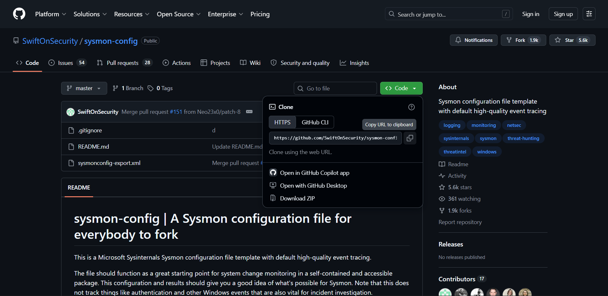

# Sysmon Installation Guide

> **System Monitor (Sysmon)** is a Microsoft Sysinternals tool that provides detailed logging of system activity, including process creation, network connections, file creation, registry modifications, and more. It is commonly used in Security Operations Centers (SOCs) for endpoint monitoring and threat detection.

---

# Prerequisites

- Windows 10 / Windows 11 / Windows Server
- Administrator privileges
- Internet connection (to download Sysmon and configuration file)

---

# Step 1: Download Sysmon

Download Sysmon from the official Microsoft Sysinternals website.

https://learn.microsoft.com/en-us/sysinternals/downloads/sysmon

Alternatively, download using PowerShell:

```powershell
Invoke-WebRequest -Uri "https://download.sysinternals.com/files/Sysmon.zip" -OutFile "Sysmon.zip"
```

---

# Step 2: Extract the ZIP File

Right-click the downloaded ZIP file and choose **Extract All**.

Or use PowerShell:

```powershell
Expand-Archive Sysmon.zip
```

You should now have files similar to:

```
Sysmon.exe
Sysmon64.exe
Eula.txt
```

---

# Step 3: Download a Sysmon Configuration

Sysmon requires a configuration file to specify which events should be logged.

The most widely used configuration is by SwiftOnSecurity.

Download:

https://github.com/SwiftOnSecurity/sysmon-config



Download the file:

```
sysmonconfig-export.xml
```

Place it in the same folder as Sysmon64.exe.

---

# Step 4: Open Command Prompt as Administrator

Navigate to the extracted folder.

Example:

```cmd
cd C:\Users\Administrator\Downloads\Sysmon
```

---

# Step 5: Install Sysmon

Run:

```cmd
Sysmon64.exe -accepteula -i sysmonconfig-export.xml
```

Explanation:

| Option | Description |
|---------|-------------|
| `-accepteula` | Automatically accepts Microsoft's EULA |
| `-i` | Installs Sysmon as a Windows service |
| `sysmonconfig-export.xml` | Configuration file |

---

# Step 6: Verify Installation

Check whether the service is running.

```cmd
sc query Sysmon64
```

or

```powershell
Get-Service Sysmon64
```

Expected output:

```
STATE : RUNNING
```

---

# Step 7: Verify Event Logs

Open Event Viewer.

Navigate to:

```
Applications and Services Logs
    Microsoft
        Windows
            Sysmon
                Operational
```

You should begin seeing events such as:

- Process Creation
- Network Connections
- Driver Loaded
- File Creation
- Registry Changes

---

# Common Sysmon Event IDs

| Event ID | Description |
|-----------|-------------|
| 1 | Process Creation |
| 2 | File Creation Time Changed |
| 3 | Network Connection |
| 5 | Process Terminated |
| 6 | Driver Loaded |
| 7 | Image Loaded (DLL) |
| 8 | CreateRemoteThread |
| 10 | Process Access |
| 11 | File Create |
| 12 | Registry Object Create/Delete |
| 13 | Registry Value Set |
| 14 | Registry Rename |
| 15 | FileCreateStreamHash |
| 17 | Pipe Created |
| 18 | Pipe Connected |
| 19 | WMI Event Filter |
| 20 | WMI Event Consumer |
| 21 | WMI Consumer to Filter Binding |
| 22 | DNS Query |
| 23 | File Delete |
| 24 | Clipboard Change |
| 25 | Process Tampering |
| 26 | File Delete Detected |
| 27 | File Block Executable |
| 28 | File Block Shredding |

---

# Check Installed Configuration

```cmd
Sysmon64.exe -c
```

This displays the currently loaded configuration.

---

# Update the Configuration

If you modify the XML file:

```cmd
Sysmon64.exe -c sysmonconfig-export.xml
```

Sysmon updates the configuration without reinstalling.

---

# Uninstall Sysmon

```cmd
Sysmon64.exe -u
```

---

# Verify Wazuh is Receiving Sysmon Logs

On the Wazuh dashboard, search for:

```
rule.groups : sysmon
```

or

```
data.win.system.providerName : Microsoft-Windows-Sysmon
```

You should observe alerts generated from Sysmon events.

---

# Troubleshooting

## No Sysmon Logs

Verify the service:

```cmd
sc query Sysmon64
```

---

## Configuration Not Loaded

Check the active configuration:

```cmd
Sysmon64.exe -c
```

---

## No Events in Event Viewer

Ensure you installed Sysmon using a valid XML configuration.

---

## Wazuh Not Detecting Sysmon

Verify that:

- Sysmon service is running.
- Events are present in Event Viewer.
- Wazuh Agent is installed.
- EventChannel collection is enabled in `ossec.conf`.
- Restart the Wazuh Agent after enabling Sysmon log collection.

---

# Useful Commands

Install

```cmd
Sysmon64.exe -accepteula -i sysmonconfig-export.xml
```

Update configuration

```cmd
Sysmon64.exe -c sysmonconfig-export.xml
```

Display current configuration

```cmd
Sysmon64.exe -c
```

Uninstall

```cmd
Sysmon64.exe -u
```

Check service

```cmd
sc query Sysmon64
```

Restart service

```cmd
net stop Sysmon64
net start Sysmon64
```

---

# References

- Microsoft Sysinternals Sysmon
  - https://learn.microsoft.com/en-us/sysinternals/downloads/sysmon

- SwiftOnSecurity Sysmon Configuration
  - https://github.com/SwiftOnSecurity/sysmon-config

---

## Next Steps

After successfully installing Sysmon:

1. Install the Wazuh Agent.
2. Enable Sysmon EventChannel collection in `ossec.conf`.
3. Restart the Wazuh Agent.
4. Generate test events (PowerShell, CMD, DNS queries, file creation, etc.).
5. Verify that Sysmon events are visible in the Wazuh Dashboard.