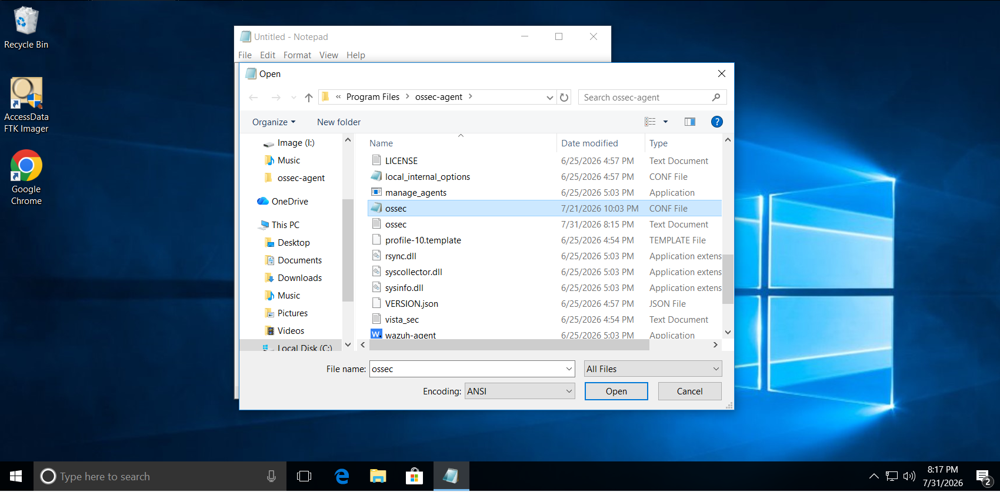
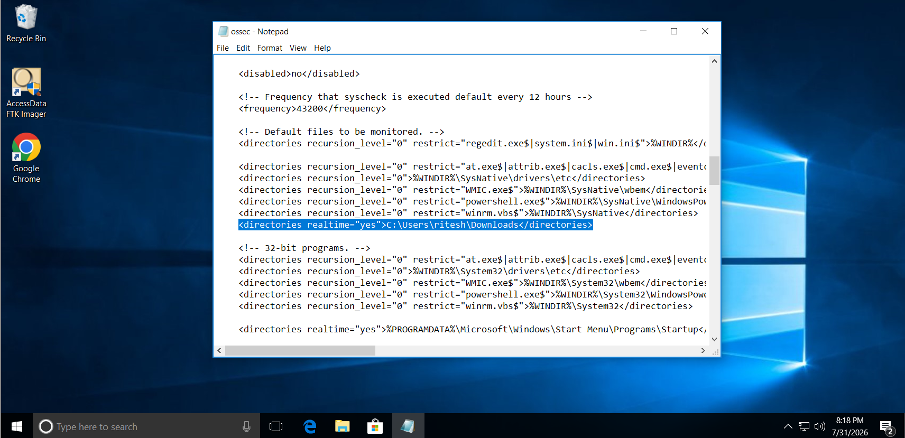

# Wazuh File Integrity Monitoring (FIM) Integration Guide

> **File Integrity Monitoring (FIM)** is one of Wazuh's core security capabilities. It continuously monitors files and directories for unauthorized creation, modification, deletion, permission changes, and metadata changes. Wazuh performs an initial baseline scan and compares future file states against that baseline to generate alerts. :contentReference[oaicite:0]{index=0}

---

# Prerequisites

- Wazuh Manager installed
- Wazuh Agent installed on the endpoint
- Agent successfully connected to the manager
- Administrator (Windows) or Root (Linux) privileges

---

# How FIM Works

When the Wazuh agent starts:

1. It scans the configured files and directories.
2. A baseline containing hashes and file metadata is created.
3. Wazuh continuously watches the configured locations.
4. Whenever a file is:
   - Created
   - Modified
   - Deleted
   - Renamed
   - Permission changed

   an alert is generated and sent to the Wazuh Manager. :contentReference[oaicite:1]{index=1}

---

# Step 1: Locate the Agent Configuration

### Windows

```text
C:\Program Files (x86)\ossec-agent\ossec.conf
```


### Linux

```text
/var/ossec/etc/ossec.conf
```

---

# Step 2: Configure FIM

Locate the `<syscheck>` section.

```xml
<syscheck>

  <directories realtime="yes" check_all="yes">
      C:\Users
  </directories>

</syscheck>
```



### Explanation

| Option | Description |
|---------|-------------|
| `disabled` | Enables the FIM module |
| `frequency` | Full scan interval (default: 12 hours) |
| `scan_on_start` | Performs a baseline scan when the agent starts |
| `realtime="yes"` | Detects changes immediately |
| `check_all="yes"` | Monitors hashes, permissions, owner, attributes, and timestamps |

Real-time monitoring is supported on local file systems for Windows and Linux. :contentReference[oaicite:2]{index=2}

---

# Example (Windows)

Monitor the Desktop folder.

```xml
<directories realtime="yes" check_all="yes">
C:\Users\Administrator\Desktop
</directories>
```

---

# Example (Linux)

```xml
<directories realtime="yes" check_all="yes">
/home
</directories>
```

---

# Step 3: Restart the Wazuh Agent

### Windows

```powershell
Restart-Service wazuh
```

or

```cmd
net stop wazuh
net start wazuh
```

---

### Linux

```bash
sudo systemctl restart wazuh-agent
```

---

# Step 4: Verify the Agent

Windows

```powershell
Get-Service wazuh
```

Linux

```bash
systemctl status wazuh-agent
```

The service should display:

```
Running
```

---

# Step 5: Generate Test Events

## Test 1 – Create a File

Create:

```
Desktop\test.txt
```

Expected alert:

```
File Added
```

---

## Test 2 – Modify a File

Open the file.

Add:

```
Hello Wazuh
```

Save it.

Expected alert:

```
File Modified
```

---

## Test 3 – Delete a File

Delete:

```
test.txt
```

Expected alert:

```
File Deleted
```

---

# Step 6: View Alerts

Open the Wazuh Dashboard.

Navigate to:

```
Security Events
```

Search for:

```
rule.groups : syscheck
```

or

```
rule.id : 550
```

You should see events indicating file creation, modification, and deletion. The exact rule IDs depend on the event type and configuration. :contentReference[oaicite:3]{index=3}

---

# Common FIM Rule IDs

| Rule ID | Description |
|----------|-------------|
| 550 | File Modified |
| 553 | File Added |
| 554 | File Deleted |

---

# Optional: Enable Who-Data Monitoring

Who-Data records:

- Username
- Process Name
- Timestamp
- File Path

Configuration:

```xml
<directories realtime="yes"
             whodata="yes"
             check_all="yes">
C:\Users\Administrator\Desktop
</directories>
```

Restart the Wazuh Agent afterward.

Who-data provides information about **who** modified a file and **which process** made the change. :contentReference[oaicite:4]{index=4}

---

# Optional: Report File Content Changes

To include text differences for supported text files:

```xml
<directories realtime="yes"
             report_changes="yes"
             check_all="yes">
C:\Users\Administrator\Desktop
</directories>
```

This allows Wazuh to display the changed content for supported text files. :contentReference[oaicite:5]{index=5}

---

# Troubleshooting

## No Alerts

Verify the agent is running.

Windows:

```powershell
Get-Service wazuh
```

Linux:

```bash
systemctl status wazuh-agent
```

---

## Real-Time Monitoring Not Working

Ensure:

- The monitored directory exists.
- `realtime="yes"` is configured.
- The Wazuh Agent has been restarted after configuration changes. :contentReference[oaicite:6]{index=6}

---

## Dashboard Shows No Events

Verify:

- Agent is connected.
- FIM is enabled.
- You modified a monitored directory.
- The manager is receiving agent events.

---

# Useful Commands

Restart Agent (Windows)

```powershell
Restart-Service wazuh
```

Restart Agent (Linux)

```bash
sudo systemctl restart wazuh-agent
```

Agent Status (Windows)

```powershell
Get-Service wazuh
```

Agent Status (Linux)

```bash
systemctl status wazuh-agent
```

---

# References

- Wazuh File Integrity Monitoring Documentation
- Basic FIM Configuration
- Advanced FIM Configuration
- Monitoring Configuration Changes

These guides explain real-time monitoring, scheduled scans, who-data, report changes, and advanced FIM tuning. :contentReference[oaicite:7]{index=7}

---

# Next Steps

After enabling File Integrity Monitoring:

1. Monitor sensitive directories (Desktop, Documents, Downloads, `/etc`, `/var/www`, etc.).
2. Enable **Who-Data** to identify the user and process responsible for changes.
3. Enable **Report Changes** for text-based configuration files.
4. Create custom Wazuh rules for high-value files.
5. Combine FIM with **Sysmon**, **VirusTotal**, and **Active Response** for a more complete endpoint detection workflow.