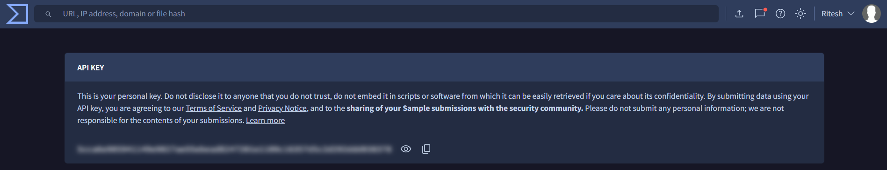
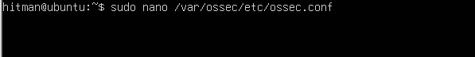
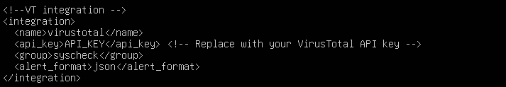
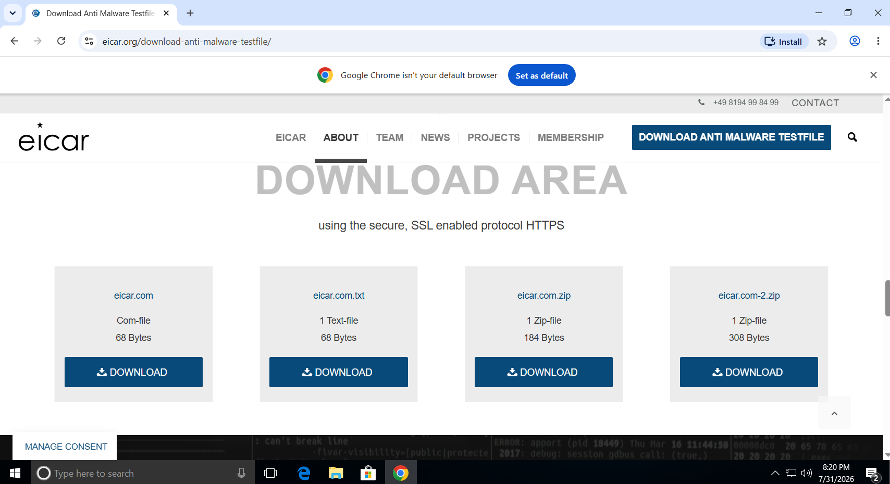
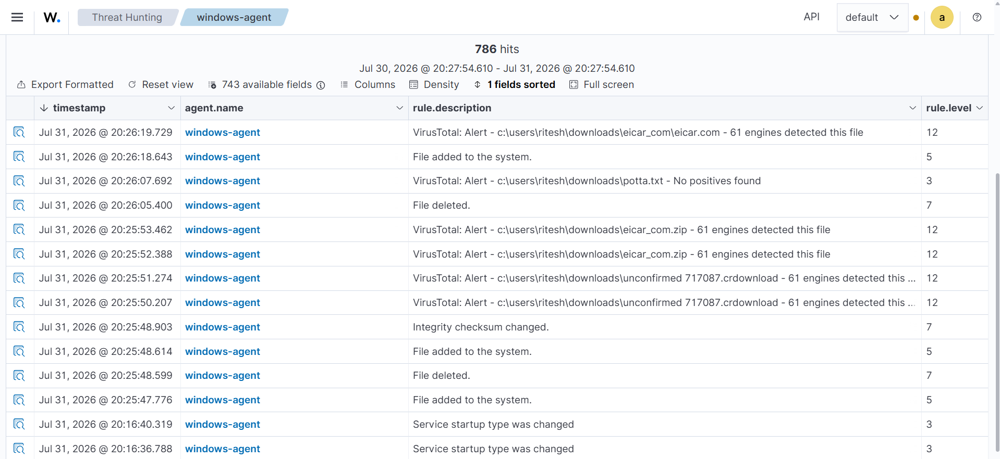
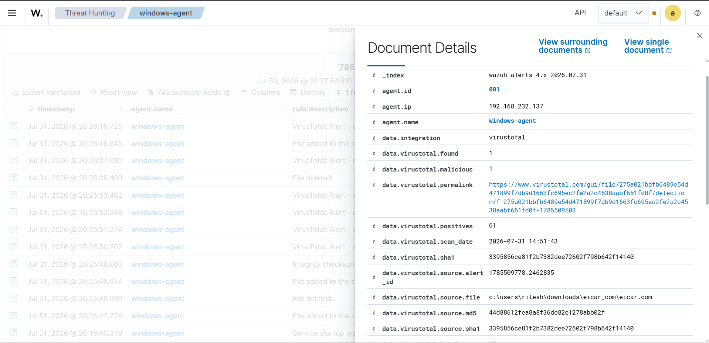
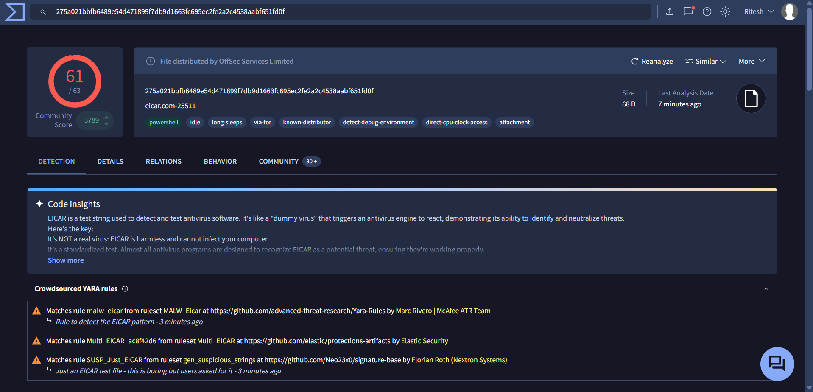

# VirusTotal Integration with Wazuh

> **VirusTotal** is a cloud-based threat intelligence platform that analyzes files, URLs, domains, and IP addresses using dozens of antivirus engines and security vendors. Wazuh integrates with VirusTotal to automatically check the reputation of files detected by **File Integrity Monitoring (FIM)**, helping analysts quickly identify known malicious files.

---

# Prerequisites

Before starting, ensure you have:

- Wazuh Manager installed and running
- Wazuh Agent installed on the endpoint
- File Integrity Monitoring (FIM) enabled
- Internet connectivity on the Wazuh Manager
- A VirusTotal API Key (free or premium)

---

# Integration Workflow

```text
File Created/Modified
        │
        ▼
 Wazuh Agent (FIM)
        │
        ▼
 Wazuh Manager
        │
        ▼
VirusTotal Integration Script
        │
        ▼
 VirusTotal API
        │
        ▼
 Reputation Result
        │
        ▼
 Wazuh Dashboard Alert
```

---

# Step 1: Create a VirusTotal Account

1. Visit:

```
https://www.virustotal.com/
```

2. Create a free account.

3. Verify your email.

---

# Step 2: Obtain the API Key

1. Log in to VirusTotal.

2. Navigate to:

```
Profile
    ↓
API Key
```

3. Copy your API Key.

Example:

```
xxxxxxxxxxxxxxxxxxxxxxxxxxxxxxxxxxxxxxxxxxxxxxxxxxxxxxxxxxxxxxxx
```



Keep this key secure and do not share it publicly.

---

# Step 3: Configure the Integration

Open the Wazuh Manager configuration:

```bash
sudo nano /var/ossec/etc/ossec.conf
```


Locate the `<integration>` section.

If it doesn't exist, add the following:

```xml
<integration>

  <name>virustotal</name>

  <api_key>YOUR_API_KEY</api_key>

  <group>syscheck</group>

  <alert_format>json</alert_format>

</integration>
```

Replace:

```
YOUR_API_KEY
```



with your VirusTotal API Key.

---

# Configuration Explanation

| Parameter | Description |
|-----------|-------------|
| `name` | Integration name |
| `api_key` | VirusTotal API Key |
| `group` | Only FIM (`syscheck`) alerts are sent |
| `alert_format` | Uses JSON alerts |

---

# Step 4: Save the Configuration

Save the file.

Restart the Wazuh Manager.

```bash
sudo systemctl restart wazuh-manager
```

Verify:

```bash
sudo systemctl status wazuh-manager
```

Expected:

```
active (running)
```

---

# Step 5: Verify the Integration

Check the integrations log.

```bash
sudo tail -f /var/ossec/logs/integrations.log
```

You should see entries similar to:

```
VirusTotal Integration Started
```

or

```
Checking file hash...
```

---

# Step 6: Test the Integration

Create or copy a file into a monitored directory.

Example:

```
Desktop\sample.exe
```

Since FIM is enabled:

1. Wazuh detects the new file.
2. Calculates its SHA256 hash.
3. Sends the hash to VirusTotal.
4. VirusTotal returns its reputation.
5. Wazuh creates an alert.

---

# Testing with the EICAR File

The EICAR file is a harmless test file recognized by antivirus products.

Create a file named:

```
eicar.com
```

Paste the following content exactly:

```text
X5O!P%@AP[4\PZX54(P^)7CC)7}$EICAR-STANDARD-ANTIVIRUS-TEST-FILE!$H+H*
```

Save it in a monitored directory.

The file should trigger:

- FIM alert
- VirusTotal lookup
- Malware detection alert

Or download the file from : https://www.eicar.org/download-anti-malware-testfile/



---

# Step 7: View Alerts

Open the Wazuh Dashboard.

Navigate to:

```
Security Events
```

Search:

```
rule.groups : virustotal
```

or

```
rule.id : 87105
```

Example alert:

```json
{
  "virustotal": {
      "found": 1,
      "positives": 65,
      "permalink": "https://www.virustotal.com/..."
  }
}
```


## For more information about the detection click on : data.virustotal.permalink



---

# Understanding the Results

| Field | Description |
|---------|-------------|
| found | File exists in VirusTotal |
| positives | Number of antivirus engines detecting the file |
| permalink | Link to the VirusTotal report |
| sha256 | File SHA256 hash |
| md5 | File MD5 hash |

---

# Example Detection Flow

```
File Created
      │
      ▼
FIM detects change
      │
      ▼
SHA256 generated
      │
      ▼
VirusTotal API lookup
      │
      ▼
65/72 detections
      │
      ▼
Wazuh Alert Generated
```

---

# Troubleshooting

## No VirusTotal Alerts

Verify:

- API Key is correct.
- Wazuh Manager restarted successfully.
- FIM is generating alerts.
- The manager has internet connectivity.

---

## API Limit Reached

The free VirusTotal API has request limits.

Typical limits:

- 4 requests per minute
- 500 requests per day

If exceeded, VirusTotal returns a rate-limit response.

---

## Integration Log Errors

Check:

```bash
sudo cat /var/ossec/logs/integrations.log
```

---

## Manager Log

```bash
sudo tail -f /var/ossec/logs/ossec.log
```

Look for:

```
virustotal
```

---

# Useful Commands

Restart Manager

```bash
sudo systemctl restart wazuh-manager
```

Manager Status

```bash
sudo systemctl status wazuh-manager
```

View Integration Logs

```bash
sudo tail -f /var/ossec/logs/integrations.log
```

View Manager Logs

```bash
sudo tail -f /var/ossec/logs/ossec.log
```

---

# Security Best Practices

- Never expose your VirusTotal API Key in public repositories.
- Store API keys securely.
- Use VirusTotal for reputation lookups only.
- Do not upload sensitive or confidential files to VirusTotal, as uploaded files may be shared with security vendors and researchers depending on your account and submission method.
- Use hash lookups whenever possible instead of uploading files.

---

# References

- VirusTotal Official Documentation
  - https://docs.virustotal.com/

- VirusTotal
  - https://www.virustotal.com/

- Wazuh VirusTotal Integration
  - https://documentation.wazuh.com/current/user-manual/capabilities/malware-detection/virus-total-integration.html

---

# Next Steps

After integrating VirusTotal:

1. Enable **File Integrity Monitoring (FIM)**.
2. Install **Sysmon** for richer endpoint telemetry.
3. Configure **Active Response** to automatically quarantine or delete known malicious files.
4. Build custom Wazuh rules for high-confidence VirusTotal detections.
5. Test the integration using the **EICAR** test file before using it in production.