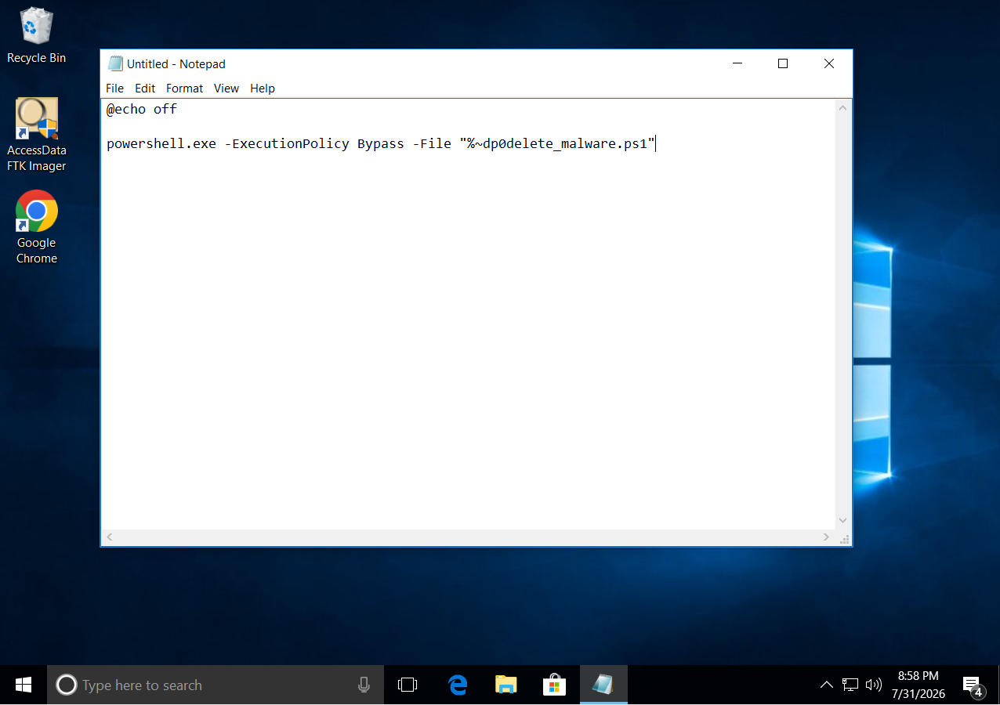
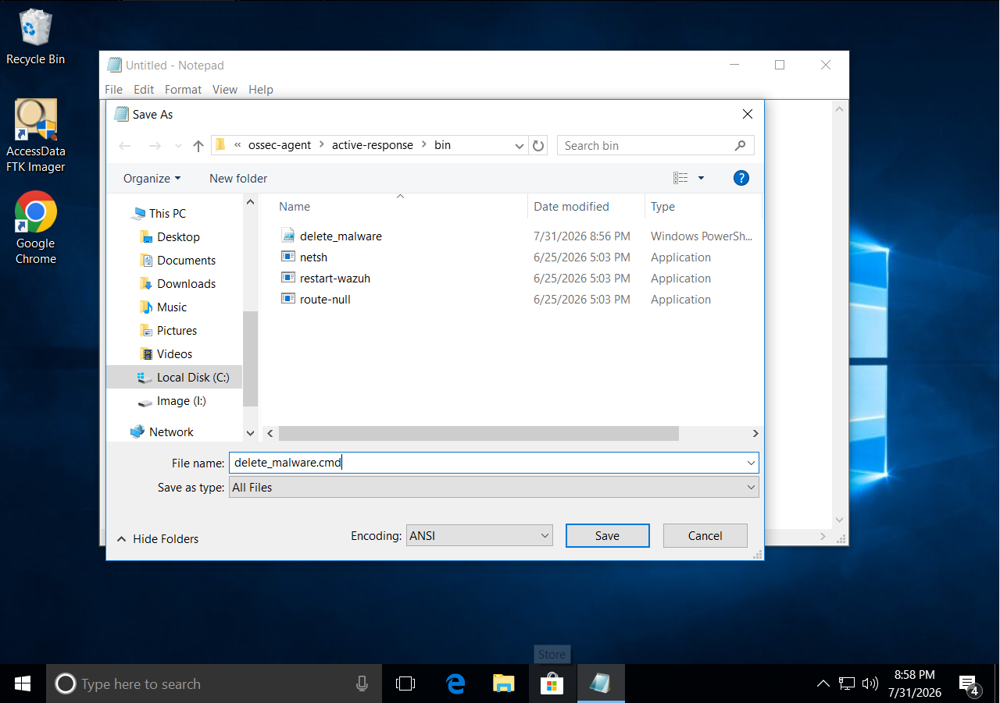
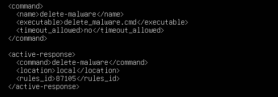
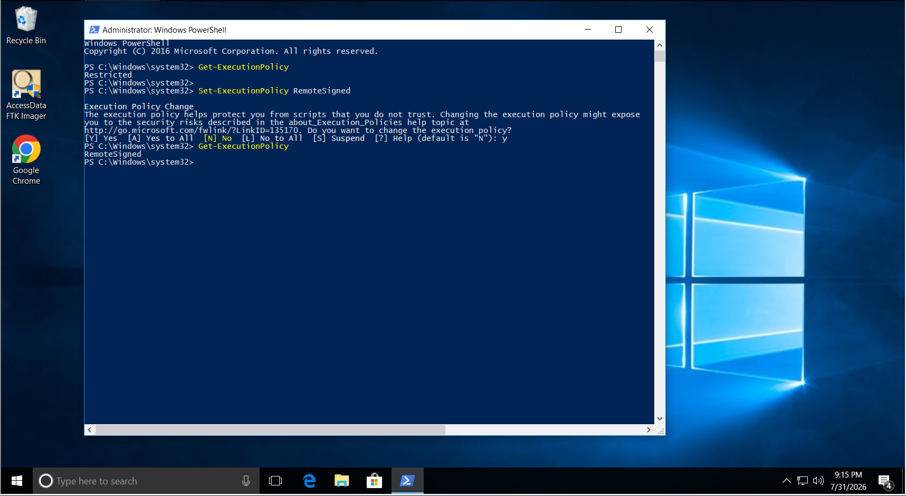

# Wazuh Active Response - Automatic Malware Removal (EICAR Test)

## Overview

This walkthrough demonstrates how to configure **Wazuh Active Response** to automatically remove malicious files detected by VirusTotal.

Instead of only generating an alert, Wazuh immediately executes a custom script on the endpoint to delete the infected file.

The **EICAR** test file is used because it is a harmless file recognized by antivirus vendors as malware for testing purposes. :contentReference[oaicite:0]{index=0}

---

# Architecture

```

EICAR File Download
↓
Sysmon + FIM Detect File
↓
VirusTotal Hash Lookup
↓
Rule 87105 Triggered
↓
Wazuh Active Response
↓
delete_malware.cmd Executes
↓
EICAR File Deleted Automatically

```

---

# Prerequisites

Before proceeding, ensure the following components are already configured.

- Wazuh Manager
- Windows Wazuh Agent
- Sysmon
- File Integrity Monitoring (FIM)
- VirusTotal Integration
- Windows Agent communicating successfully with Manager

---

# Step 1 — Create Active Response Script

On the Windows Agent, navigate to:

```

C:\Program Files (x86)\ossec-agent\active-response\bin

```

Create a new file named:

```

delete_malware.cmd

```

Paste the following:

```cmd
@echo off

powershell.exe -ExecutionPolicy Bypass -File "%~dp0delete_malware.ps1"
```


Save the file, And also create a delete_malware.ps1 in the same folder

Paste the following:
```cmd
# delete_malware.ps1
# Wazuh Active Response - deletes files flagged malicious by VirusTotal / FIM
# Place in: C:\Program Files\ossec-agent\active-response\bin\delete_malware.ps1

$ErrorActionPreference = "SilentlyContinue"
$LogFile = "C:\Program Files\ossec-agent\active-response\active-responses.log"

function Write-Log {
    param([string]$Message)
    $timestamp = (Get-Date).ToString("yyyy/MM/dd HH:mm:ss")
    "$timestamp delete_malware.ps1: $Message" | Out-File -FilePath $LogFile -Append -Encoding utf8
}

$InputData = [Console]::In.ReadToEnd()
Write-Log "RAW INPUT: $InputData"   # temporary, for debugging - remove once confirmed working

try {
    $Json = $InputData | ConvertFrom-Json
} catch {
    Write-Log "ERROR: Failed to parse JSON input: $_"
    exit 1
}

$Command = $Json.command
if ($Command -ne "add") {
    Write-Log "Command '$Command' received - no action taken."
    exit 0
}

$Alert = $Json.parameters.alert

# Try VirusTotal path first, then FIM syscheck path as fallback
$TargetPath = $Alert.data.virustotal.source.file
if (-not $TargetPath) { $TargetPath = $Alert.syscheck.path }

if (-not $TargetPath) {
    Write-Log "ERROR: No target path found in alert JSON."
    exit 1
}

Write-Log "Received request to remove: $TargetPath"

# --- Safety checks ---
$ProtectedPaths = @(
    "C:\Windows",
    "C:\Program Files",
    "C:\Program Files (x86)",
    "C:\Users\All Users"
)

foreach ($p in $ProtectedPaths) {
    if ($TargetPath.ToLower().StartsWith($p.ToLower())) {
        Write-Log "REFUSED: '$TargetPath' is inside protected directory."
        exit 1
    }
}

if (-not (Test-Path -LiteralPath $TargetPath)) {
    Write-Log "WARNING: Path '$TargetPath' does not exist (may already be removed)."
    exit 0
}

# --- Delete file AND its parent folder if empty afterward ---
try {
    if (Test-Path -LiteralPath $TargetPath -PathType Container) {
        Remove-Item -LiteralPath $TargetPath -Recurse -Force
        Write-Log "SUCCESS: Deleted malicious folder '$TargetPath'."
    } else {
        Remove-Item -LiteralPath $TargetPath -Force
        Write-Log "SUCCESS: Deleted malicious file '$TargetPath'."

        # Optionally remove the parent folder too if it's now empty
        $ParentDir = Split-Path -Path $TargetPath -Parent
        if ((Test-Path -LiteralPath $ParentDir) -and
            ((Get-ChildItem -LiteralPath $ParentDir -Force | Measure-Object).Count -eq 0)) {
            Remove-Item -LiteralPath $ParentDir -Force
            Write-Log "SUCCESS: Removed now-empty parent folder '$ParentDir'."
        }
    }
    exit 0
} catch {
    Write-Log "ERROR: Failed to delete '$TargetPath' - $_"
    exit 1
}

```
save the file.



---

# Step 2 — Register the Command

Open the Wazuh Manager configuration file (on Ubuntu): 

```

/var/ossec/etc/ossec.conf

```


Add the following inside `<ossec_config>`.

```xml
<command>
    <name>delete-malware</name>
    <executable>delete_malware.cmd</executable>
    <timeout_allowed>no</timeout_allowed>
</command>

```

---

# Step 3 — Configure Active Response

Add the following immediately below the previous section.

```xml
<active-response>

    <command>delete-malware</command>

    <location>local</location>

    <rules_id>87105</rules_id>

</active-response>
```

Rule **87105** is triggered when VirusTotal classifies a monitored file as malicious. :contentReference[oaicite:1]{index=1}


---

# Step 4 — Restart Wazuh Manager

Restart the manager to apply the new configuration.

```bash
sudo systemctl restart wazuh-manager
```

Verify the service is running.

```bash
sudo systemctl status wazuh-manager
```

---

# Step 5 — Windows permission on executing delete_malware.ps1

Verify current status on windows :

open powershell as administrator
```powershell

Get-ExecutionPolicy

```
if it shows : RemoteSigned then no worries 

if not , execte the following command

```powershell

Set-ExecutionPolicy RemoteSigned

```
then click : y

verify again

```powershell

Get-ExecutionPolicy

```


---

# Step 6 — Download the EICAR Test File

Open Command Prompt on the Windows endpoint.

Run:

```powershell
curl.exe -o C:\Users\<username>\Downloads\eicar.com https://secure.eicar.org/eicar.com
```

or simply download it manually from:

https://secure.eicar.org/eicar.com

The EICAR file is a safe antivirus test file and is commonly used to validate malware detection workflows. :contentReference[oaicite:2]{index=2}

---

# Step 7 — Observe Detection

The following sequence should occur automatically.

### File Created

```

Rule 554

```

↓

### VirusTotal Scan

```

Rule 87105

```

↓

### Active Response Executed

```

delete_malware.cmd

```

↓

### File Deleted

```

Rule 553
Rule 110006

```

This demonstrates the complete detection-to-response workflow. :contentReference[oaicite:3]{index=3}

---

# Step 8 — Verify Active Response Log

On the Windows Agent, open:

```

C:\Program Files (x86)\ossec-agent\active-response\active-responses.log

```

Example:

```

Successfully removed threat

```

The Active Response log confirms that the removal command executed successfully. :contentReference[oaicite:4]{index=4}

---

# Expected Alert Flow

| Stage | Rule ID |
|----------|---------|
| File Added | 554 |
| VirusTotal Detection | 87105 |
| File Deleted | 553 |
| Active Response Executed | 110006 |

---

# Verification Checklist

- ✅ FIM detected the file
- ✅ VirusTotal identified the file as malicious
- ✅ Rule 87105 generated
- ✅ Active Response executed
- ✅ File automatically deleted
- ✅ Active Response log updated

---

# Result

After completing this walkthrough, Wazuh automatically responds to malware detections by executing a custom Active Response script on the Windows endpoint.

Using the harmless **EICAR** test file validates the complete workflow—from detection with File Integrity Monitoring and VirusTotal to automatic file removal—demonstrating an end-to-end automated incident response process within the SOC lab. :contentReference[oaicite:5]{index=5}